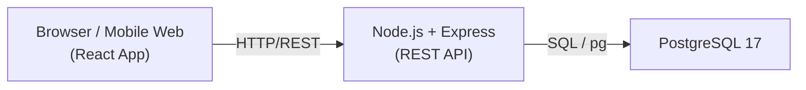
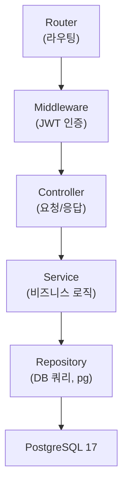
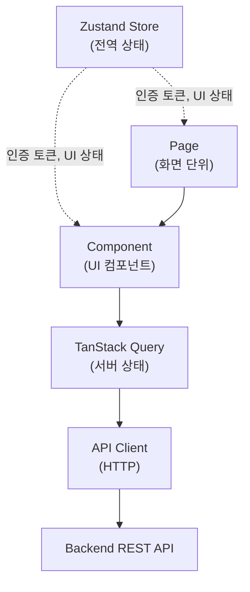
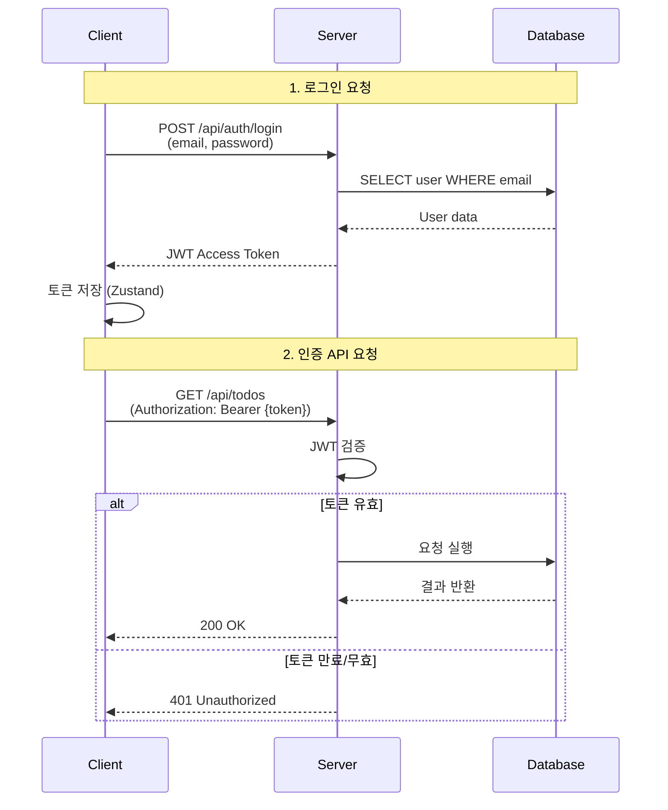
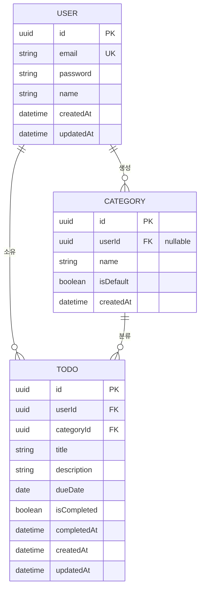

# TodoListApp 기술 아키텍처 다이어그램

---

## 문서 정보

| 항목 | 내용 |
|------|------|
| 버전 | v1.2 |
| 작성일 | 2026-05-12 |
| 최종 수정일 | 2026-05-14 |
| 작성자 | HEOTAEHWAN |
| 참조 | PRD v1.1, 도메인 정의서 v1.2, 구조설계원칙 v1.0 |
| 상태 | 작성 완료 |

---

## 개요

본 문서는 TodoListApp의 전체 기술 아키텍처를 시각화합니다. 시스템 구성부터 세부 레이어, 인증 흐름, 데이터베이스 관계까지 핵심 흐름만 단순하게 표현합니다.

---

## 다이어그램 1: 시스템 전체 구성도

클라이언트, 서버, 데이터베이스의 3개 주요 영역과 통신 경로를 보여줍니다.

**설명**: 사용자는 웹 브라우저 또는 모바일 웹 클라이언트에서 React 애플리케이션을 사용합니다. 모든 요청은 HTTP/REST 프로토콜을 통해 Node.js 서버로 전달되며, 서버는 PostgreSQL 데이터베이스와 pg 라이브러리를 통해 통신합니다.

---

## 다이어그램 2: 백엔드 레이어 구조

Express 기반 REST API의 계층별 역할을 표현합니다.

**설명**: 요청은 라우터에서 시작하여 JWT 미들웨어를 통해 인증 검증, 컨트롤러가 요청/응답 처리, 서비스 레이어에서 비즈니스 로직 실행, 레포지토리 패턴으로 pg 라이브러리를 사용한 직접 SQL 쿼리를 수행합니다.

---

## 다이어그램 3: 프론트엔드 레이어 구조

React 기반 클라이언트의 계층별 구성을 표현합니다.

**설명**: 페이지가 여러 컴포넌트를 조합하며, 컴포넌트는 TanStack Query를 통해 서버 상태를 관리합니다. API Client는 HTTP 요청을 백엔드로 전송합니다. Zustand Store는 인증 토큰과 UI 상태를 전역으로 관리하여 페이지와 컴포넌트에 주입됩니다.

---

## 다이어그램 4: JWT 인증 흐름

로그인 및 API 요청 시 JWT 토큰 처리 과정을 나타냅니다.

**설명**: 사용자가 로그인하면 서버는 이메일과 비밀번호를 검증하여 JWT 토큰을 발급합니다. 토큰은 **Zustand 메모리(authStore)에만 저장**되며, httpOnly Cookie·localStorage·sessionStorage는 사용하지 않습니다. axios 인터셉터가 요청마다 authStore에서 토큰을 읽어 `Authorization: Bearer` 헤더에 자동 주입합니다. 탭/브라우저를 닫으면 토큰이 소멸되므로 재로그인이 필요합니다. 서버는 미들웨어에서 토큰을 검증하고 유효하지 않으면 401 Unauthorized를 응답합니다.

---

## 다이어그램 5: 데이터베이스 엔티티 관계도 (ERD)

3개 핵심 테이블과 관계를 간단히 표현합니다.

**설명**: 
- **User**: 시스템 사용자. email은 전체 고유 값입니다.
- **Category**: 할일 분류 카테고리. isDefault=true인 경우 기본 카테고리(userId=NULL), false인 경우 사용자 정의 카테고리입니다.
- **Todo**: 사용자의 할일 항목. userId와 categoryId는 필수 FK이며, 사용자 삭제 시 ON DELETE CASCADE로 연쇄 삭제됩니다.

관계:
- User 1 → N Todo: 사용자는 여러 할일 소유
- User 1 → N Category: 사용자는 여러 사용자 정의 카테고리 생성
- Category 1 → N Todo: 카테고리는 여러 할일 분류

---

## 기술 스택 요약

| 영역 | 기술 |
|------|------|
| **Frontend** | React 19, TypeScript, Zustand (전역 상태), TanStack Query (서버 상태), axios (HTTP 클라이언트), Mobile-first 반응형 CSS |
| **Backend** | Node.js 22 LTS, Express 5.2.1, REST API, JWT 인증, Joi (입력 검증), swagger-ui-express 5.0.1 (API 문서화) |
| **Database** | PostgreSQL 17, pg 라이브러리 (ORM 미사용) |
| **아키텍처** | 레이어드 아키텍처 (Router → Middleware → Controller → Service → Repository) |
| **인증** | JWT Access Token (1차) / OAuth Social 전략 패턴으로 확장 예정 (2차) / Refresh Token은 2차 검토 |
| **배포** | Mobile-first 반응형 웹 (PC + Mobile Web) |

---

## 핵심 설계 원칙

1. **단순성**: 불필요한 세부사항 제거, 핵심 흐름만 표현
2. **계층 분리**: 백엔드와 프론트엔드의 명확한 역할 구분
3. **상태 관리**: 서버 상태(TanStack Query)와 클라이언트 상태(Zustand) 분리
4. **보안**: JWT 기반 인증, 데이터 격리(각 사용자는 자신의 데이터만 접근)
5. **데이터 무결성**: FK 제약, ON DELETE CASCADE로 관계 데이터 일관성 보장

---

---

## 변경 이력

| 버전 | 날짜 | 변경 내용 |
|------|------|-----------|
| v1.1 | 2026-05-12 | 최초 작성 |
| v1.2 | 2026-05-14 | 기술 스택 업데이트: Express 4.x → 5.2.1, swagger-ui-express 5.0.1 추가 (API 문서화 `/api-docs`) |

*최종 수정일: 2026-05-14 | 버전: v1.2 | 참조: PRD v1.2, 도메인 정의서 v1.2, 구조설계원칙 v1.1*
