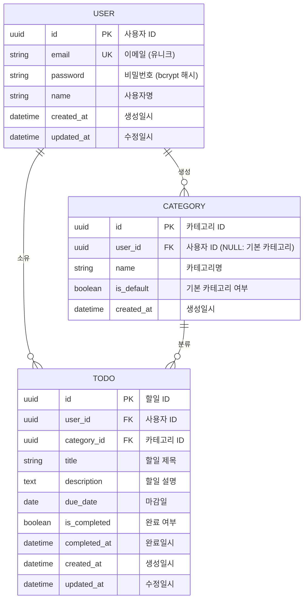

# ERD (Entity Relationship Diagram)

## 문서 정보

| 항목 | 내용 |
|------|------|
| 버전 | v1.0 |
| 작성일 | 2026-05-12 |
| 참조 문서 | PRD v1.2, 도메인 정의서 v1.2 |
| 작성자 | HEOTAEHWAN |
| 대상 | 데이터베이스 설계, 백엔드 개발 |

---

## ERD 다이어그램



---

## 엔티티 상세 설명

### USER (사용자)

| 컬럼명 | 타입 | 제약 | 설명 |
|--------|------|------|------|
| `id` | UUID | PK, NOT NULL, DEFAULT gen_random_uuid() | 사용자 고유 식별자 |
| `email` | VARCHAR(255) | UNIQUE, NOT NULL | 로그인 이메일 (고유값) |
| `password` | VARCHAR(255) | NOT NULL | bcrypt 해시된 비밀번호 |
| `name` | VARCHAR(100) | NOT NULL | 사용자명 |
| `created_at` | TIMESTAMPTZ | NOT NULL, DEFAULT NOW() | 계정 생성 일시 |
| `updated_at` | TIMESTAMPTZ | NOT NULL, DEFAULT NOW() | 정보 수정 일시 |

**특성:**
- 애플리케이션의 기본 주체 엔티티
- 모든 사용자 정의 카테고리와 할일의 소유자
- 삭제 시 관련 데이터 연쇄 삭제 (ON DELETE CASCADE)

---

### CATEGORY (카테고리)

| 컬럼명 | 타입 | 제약 | 설명 |
|--------|------|------|------|
| `id` | UUID | PK, NOT NULL, DEFAULT gen_random_uuid() | 카테고리 고유 식별자 |
| `user_id` | UUID | FK → users(id), NULLABLE | 사용자 ID (NULL: 기본 카테고리) |
| `name` | VARCHAR(50) | NOT NULL | 카테고리명 |
| `is_default` | BOOLEAN | NOT NULL, DEFAULT false | 기본 카테고리 여부 |
| `created_at` | TIMESTAMPTZ | NOT NULL, DEFAULT NOW() | 생성 일시 |

**특성:**
- 두 가지 타입으로 구분:
  - **기본 카테고리**: `is_default=true`, `user_id=NULL` (시스템 제공)
  - **사용자 정의 카테고리**: `is_default=false`, `user_id=<사용자 ID>` (사용자 생성)
- 기본 카테고리는 수정·삭제 불가 (BR-08)
- 기본 카테고리 3개: 일반, 업무, 개인 (사용자당 공유)
- 사용자 삭제 시 관련 사용자 정의 카테고리 연쇄 삭제 (ON DELETE CASCADE)

---

### TODO (할일)

| 컬럼명 | 타입 | 제약 | 설명 |
|--------|------|------|------|
| `id` | UUID | PK, NOT NULL, DEFAULT gen_random_uuid() | 할일 고유 식별자 |
| `user_id` | UUID | FK → users(id), NOT NULL | 할일 소유자 사용자 ID |
| `category_id` | UUID | FK → categories(id), NOT NULL | 할일 분류 카테고리 ID |
| `title` | VARCHAR(200) | NOT NULL | 할일 제목 |
| `description` | TEXT | NULLABLE | 할일 상세 설명 |
| `due_date` | DATE | NULLABLE | 마감일 (선택사항) |
| `is_completed` | BOOLEAN | NOT NULL, DEFAULT false | 완료 여부 |
| `completed_at` | TIMESTAMPTZ | NULLABLE | 완료 일시 |
| `created_at` | TIMESTAMPTZ | NOT NULL, DEFAULT NOW() | 생성 일시 |
| `updated_at` | TIMESTAMPTZ | NOT NULL, DEFAULT NOW() | 수정 일시 |

**특성:**
- 사용자가 작성하는 핵심 업무 데이터
- 사용자 삭제 시 연쇄 삭제 (ON DELETE CASCADE, DC-01)
- `is_completed=true`일 때 `completed_at` 자동 설정
- `due_date` 기반 정렬 및 필터링 지원 (DC-08)

---

## 관계 상세

### 1. USER → TODO ("소유")

| 항목 | 내용 |
|------|------|
| **카디널리티** | 1:N (1명의 사용자 : N개의 할일) |
| **FK** | `todos.user_id` → `users.id` |
| **CASCADE 정책** | ON DELETE CASCADE (DC-01) |
| **설명** | 사용자는 0개 이상의 할일 소유. 사용자 삭제 시 모든 할일도 함께 삭제. |
| **비즈니스 규칙** | DC-01: 사용자 계정 삭제 시 관련 모든 데이터 삭제 |

**세부 정책:**
- 사용자 계정 탈퇴 요청 시 할일 및 관련 카테고리를 안전하게 정리
- 삭제 전 데이터 백업 권장 (애플리케이션 레벨)

---

### 2. USER → CATEGORY ("생성")

| 항목 | 내용 |
|------|------|
| **카디널리티** | 1:N (1명의 사용자 : N개의 카테고리) |
| **FK** | `categories.user_id` → `users.id` |
| **CASCADE 정책** | ON DELETE CASCADE (DC-01) |
| **설명** | 사용자는 0개 이상의 사용자 정의 카테고리 생성. 기본 카테고리는 user_id=NULL. |
| **비즈니스 규칙** | DC-01: 사용자 계정 삭제 시 사용자 정의 카테고리 삭제 |

**세부 정책:**
- 기본 카테고리(is_default=true)는 CASCADE의 영향을 받지 않음
- 사용자 정의 카테고리(is_default=false)만 삭제됨
- 사용자 삭제 시 미분류 할일은 기본 '일반' 카테고리로 이관 후 정리

---

### 3. CATEGORY → TODO ("분류")

| 항목 | 내용 |
|------|------|
| **카디널리티** | 1:N (1개의 카테고리 : N개의 할일) |
| **FK** | `todos.category_id` → `categories.id` |
| **CASCADE 정책** | 애플리케이션 레벨 처리 (삭제 금지 또는 이관) |
| **설명** | 카테고리는 0개 이상의 할일 분류. 카테고리 삭제 시 할일은 '일반' 카테고리로 이관. |
| **비즈니스 규칙** | BR-09: 카테고리 삭제 시 해당 할일은 '일반' 카테고리로 이관 |

**세부 정책:**
- **DB 레벨**: 관계는 설정되지만 CASCADE 비활성화
- **애플리케이션 레벨**: 카테고리 삭제 전 모든 할일을 '일반'(기본 카테고리) 으로 이관하는 트랜잭션 처리
- 기본 카테고리는 삭제 불가하므로 할일이 항상 유효한 카테고리에 할당됨

---

## 주요 제약 조건 요약

### DB 레벨 제약 (데이터베이스에서 강제)

| 제약 | 엔티티 | 컬럼 | 규칙 | 목적 |
|------|--------|------|------|------|
| PK | ALL | id | 각 엔티티의 id는 고유하고 NULL 불가 | 엔티티 식별 |
| FK | TODO | user_id | users.id 참조 | 사용자와 할일 관계 보장 |
| FK | TODO | category_id | categories.id 참조 | 카테고리와 할일 관계 보장 |
| FK | CATEGORY | user_id | users.id 참조 (NULLABLE) | 사용자와 카테고리 관계 보장 |
| UNIQUE | USER | email | 중복 불가 | 로그인 일관성 |
| NOT NULL | USER | password, name | 필수값 | 계정 정보 완성도 |
| NOT NULL | CATEGORY | name, is_default | 필수값 | 카테고리 정보 완성도 |
| NOT NULL | TODO | title, user_id, category_id | 필수값 | 할일 정보 완성도 |
| CASCADE | USER → TODO | user_id | 사용자 삭제 시 할일 삭제 | 데이터 무결성 (DC-01) |
| CASCADE | USER → CATEGORY | user_id | 사용자 삭제 시 사용자 정의 카테고리 삭제 | 데이터 무결성 (DC-01) |

### 애플리케이션 레벨 제약 (애플리케이션 코드에서 강제)

| 제약 | 엔티티 | 규칙 | 목적 | 참조 |
|------|--------|------|------|------|
| 기본 카테고리 보호 | CATEGORY | is_default=true이면 수정·삭제 금지 | 시스템 카테고리 무결성 | BR-08 |
| 카테고리 삭제 처리 | TODO | 사용자 정의 카테고리 삭제 시 할일을 '일반' 카테고리로 이관 후 카테고리 삭제 | 할일 데이터 손실 방지 | BR-09 |
| 완료 일시 자동 설정 | TODO | is_completed=true로 변경 시 completed_at에 현재 시각 자동 입력 | 완료 시간 추적 | DC-02 |
| 마감일 필터링 | TODO | due_date 기반 마감 임박 할일 조회 | 사용자 편의성 | DC-08 |
| 권한 검증 | ALL | 사용자는 자신의 데이터만 조회·수정 가능 | 데이터 보안 | 액세스 제어 |

---

## 인덱스 설계

인덱스는 조회 성능을 위해 설계되었습니다. 자주 조회되는 필터와 정렬 기준을 기반으로 합니다.

### 권장 인덱스 목록

| 테이블 | 컬럼 | 타입 | 조회 패턴 | 성능 목표 |
|--------|------|------|---------|---------|
| `users` | `email` | UNIQUE INDEX | 로그인 (email로 사용자 검색) | O(log N) |
| `todos` | `user_id` | INDEX | 사용자의 모든 할일 조회 | O(log N) |
| `todos` | `(user_id, is_completed)` | COMPOSITE INDEX | 사용자의 미완료/완료 할일 필터링 | O(log N) |
| `todos` | `(user_id, due_date)` | COMPOSITE INDEX | 사용자의 마감일 기반 조회 (DC-08) | O(log N) |
| `todos` | `(user_id, category_id)` | COMPOSITE INDEX | 사용자의 카테고리별 할일 조회 | O(log N) |
| `todos` | `category_id` | INDEX | 카테고리별 할일 조회 | O(log N) |
| `todos` | `is_completed` | INDEX | 전체 할일 완료 여부 필터링 | O(log N) |
| `categories` | `user_id` | INDEX | 사용자의 카테고리 조회 | O(log N) |

### 인덱스 생성 SQL 예시

```sql
-- users 테이블
CREATE UNIQUE INDEX idx_users_email ON users(email);

-- todos 테이블 - 단일 컬럼 인덱스
CREATE INDEX idx_todos_user_id ON todos(user_id);
CREATE INDEX idx_todos_category_id ON todos(category_id);
CREATE INDEX idx_todos_is_completed ON todos(is_completed);

-- todos 테이블 - 복합 인덱스 (자주 함께 조회되는 컬럼)
CREATE INDEX idx_todos_user_completed ON todos(user_id, is_completed);
CREATE INDEX idx_todos_user_due_date ON todos(user_id, due_date);
CREATE INDEX idx_todos_user_category ON todos(user_id, category_id);

-- categories 테이블
CREATE INDEX idx_categories_user_id ON categories(user_id);
```

### 인덱스 설계 고려사항

1. **로그인 조회**: `users.email`은 UNIQUE INDEX로 설정하여 중복 방지 및 빠른 조회
2. **사용자별 필터링**: 대부분의 조회는 특정 사용자의 데이터이므로 `user_id` 포함 인덱스 우선
3. **복합 인덱스**: `(user_id, is_completed)`, `(user_id, due_date)` 등으로 여러 조건 조회 최적화
4. **쓰기 성능**: 인덱스가 많을수록 INSERT/UPDATE/DELETE 성능 저하 → 자주 조회되는 패턴만 선정
5. **메모리 사용**: 프로덕션 데이터베이스 크기와 메모리 용량을 고려하여 조정

---

## 데이터 흐름 예시

### 사용자 가입 시
1. **USER** 레코드 생성 (email, password, name)
2. 기본 카테고리(일반, 업무, 개인) 자동 할당 — 실제로는 공유 기본 카테고리 참조

### 할일 생성 시
1. 사용자가 선택한 카테고리 ID 검증 (CATEGORY 테이블에서 사용자 소유 또는 기본 카테고리)
2. **TODO** 레코드 생성 (user_id, category_id, title, due_date 등)

### 카테고리 삭제 시
1. 애플리케이션에서 해당 카테고리의 모든 TODO 조회
2. TODO의 category_id를 '일반' 카테고리로 UPDATE (트랜잭션)
3. CATEGORY 삭제

### 사용자 탈퇴 시
1. 사용자의 모든 TODO 및 사용자 정의 CATEGORY 자동 삭제 (ON DELETE CASCADE)
2. USER 레코드 삭제
3. (선택) 삭제 전 데이터 백업 수행

---

## 버전 관리 및 변경 이력

| 버전 | 작성일 | 변경 내용 |
|------|--------|---------|
| v1.0 | 2026-05-12 | 초기 ERD 설계 — PRD v1.2, 도메인 정의서 v1.2 기준 |

---

## 참고 문서

- [PRD (Product Requirement Document)](./2-PRD.md)
- [도메인 정의서](./1-domain-definition.md)
- [사용자 시나리오](./3-user-scenario.md)
- [아키텍처 다이어그램](./5-arch-diagram.md)
