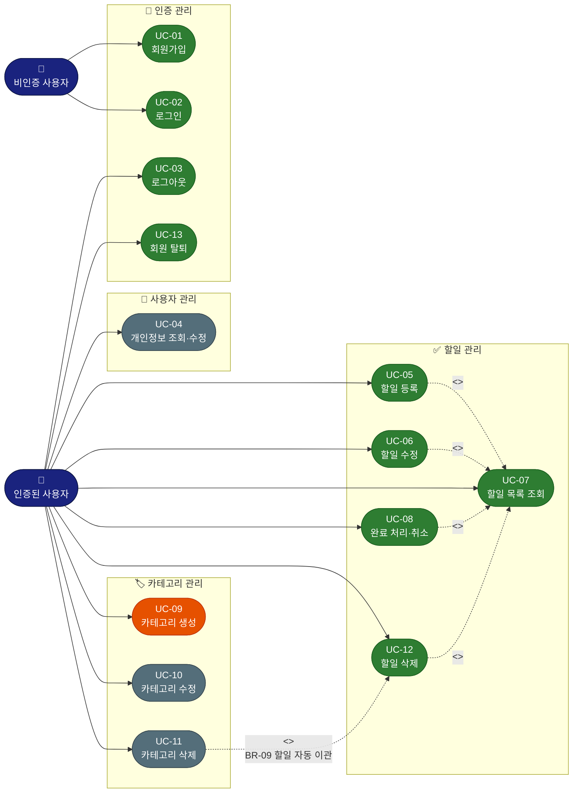

# TodoListApp — Use Case Diagram

---

## 문서 정보

| 항목 | 내용 |
|------|------|
| 버전 | v1.0 |
| 작성일 | 2026-05-12 |
| 참조 | PRD v1.1, 도메인 정의서 v1.2 |

---

## 릴리즈 범위 범례

| 표기 | 의미 |
|------|------|
| 🟢 녹색 노드 | 1차 MVP — P0 (반드시 포함) |
| 🟠 주황 노드 | 1차 MVP — P1 (일정 여유 시 포함) |
| 🔘 회색 노드 | 2차 릴리즈 — Post-MVP |

---

## Use Case Diagram

---

## UC 관계 상세

| 관계 | 유형 | 설명 |
|------|------|------|
| UC-05 → UC-07 | `<<include>>` | 할일 등록 후 목록 화면으로 복귀하여 결과 확인 |
| UC-06 → UC-07 | `<<include>>` | 할일 수정 후 목록 화면으로 복귀하여 결과 확인 |
| UC-08 → UC-07 | `<<include>>` | 완료 처리·취소는 목록 화면에서 인라인으로 수행 |
| UC-12 → UC-07 | `<<include>>` | 할일 삭제는 목록 화면에서 수행 |
| UC-11 → UC-12 | `<<extend>>` | 카테고리 삭제 시 해당 카테고리 할일이 존재하면 '일반'으로 자동 이관(BR-09). 삭제 자체는 별도 DELETE 수행 |

---

## UC 전체 목록

| UC ID | 유스케이스 | 액터 | 릴리즈 | 관련 규칙 |
|-------|-----------|------|--------|----------|
| UC-01 | 회원가입 | 비인증 사용자 | 1차 P0 | BR-02, DC-05, DC-06 |
| UC-02 | 로그인 | 비인증 사용자 | 1차 P0 | BR-01, DC-06 |
| UC-03 | 로그아웃 | 인증된 사용자 | 1차 P0 | BR-01, DC-06 |
| UC-04 | 개인정보 조회·수정 | 인증된 사용자 | 2차 | DC-05 |
| UC-05 | 할일 등록 | 인증된 사용자 | 1차 P0 | BR-03, BR-05, BR-07, DC-03 |
| UC-06 | 할일 수정 | 인증된 사용자 | 1차 P0 | BR-03, BR-05, BR-07, DC-03 |
| UC-07 | 할일 목록 조회 | 인증된 사용자 | 1차 P0 | BR-03, DC-08, DC-09 |
| UC-08 | 할일 완료 처리·취소 | 인증된 사용자 | 1차 P0 | BR-03, BR-06 |
| UC-09 | 카테고리 생성 | 인증된 사용자 | 1차 P1 | BR-04, BR-10, DC-04 |
| UC-10 | 카테고리 수정 | 인증된 사용자 | 2차 | BR-04, BR-08, BR-10, DC-04 |
| UC-11 | 카테고리 삭제 | 인증된 사용자 | 2차 | BR-04, BR-08, BR-09 |
| UC-12 | 할일 삭제 | 인증된 사용자 | 1차 P0 | BR-03, DC-01 |
| UC-13 | 회원 탈퇴 | 인증된 사용자 | 1차 P0 | DC-01 |

---

*작성일: 2026-05-12 | 버전: v1.0 | 참조: 도메인 정의서 v1.2, PRD v1.1*
